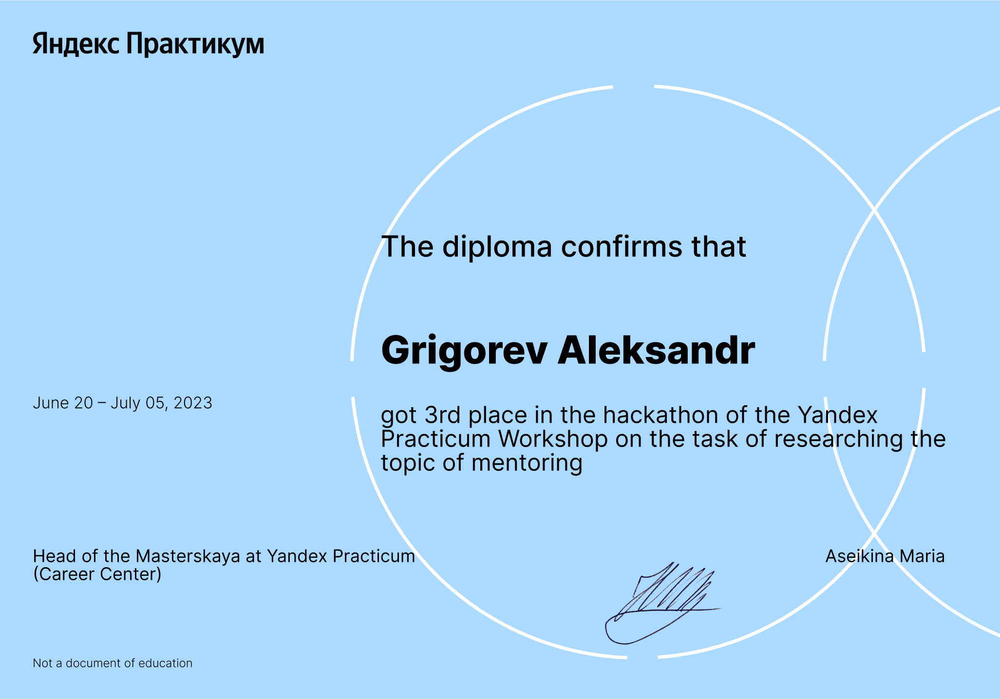
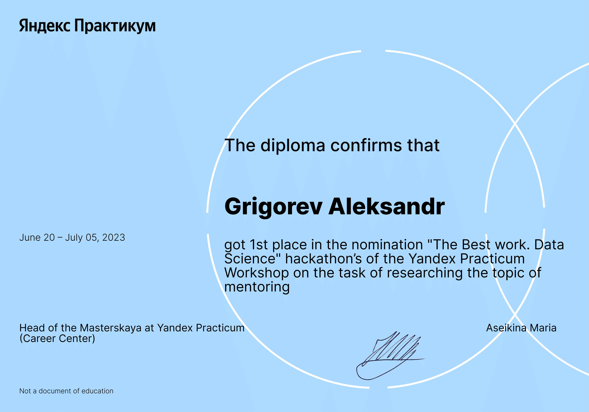

Яндекс Практикум, DS+

# Хакатон по исследованию LinkedIn от Яндекс Практикума

Тип проекта: веб-скрейпинг, парсинг, предобработка, анализ данных, визуализация, машинное обучение, NLP, тематическое моделирование

Стек: `jupyter-notebook`, `python`, `selenium`, `BeautifulSoup`, `pandas`, `numpy`, `matplotlib`, `seaborn`, `nltk`, `pymorphy2`, `sklearn`

Рассмотрим выполнение проекта подробнее в [jupyter notebook](https://github.com/krasnoturinsk/linkedin_hackathon/blob/main/src/linkedin_mentoring_rev.ipynb) {Python  3.10.11} или в [PDF](https://github.com/krasnoturinsk/linkedin_hackathon/blob/main/linkedin_mentoring_rev.pdf).

---

## Описание задачи

**Бизнес-требования**

1. Отрасль и направления деятельности: _EdTech_, сервис онлайн образования.

2. Общее описание задачи: провести исследование по теме наставничества и менторства на основании контента социальной сети _Linkedin_, размещенного в открытом доступе, созданного целевой аудиторией.

3. Цели исследования:

	– Определить топ-10 тем в направлении наставничества на основании наибольшего охвата, используя теги `наставничество`, `менторство`, `коучинг`, `mentorship`, `mentor`, `coaching`, `buddy`.

	– Определить топ-10 популярных тем по просмотрам, реакциям: лайкам, комментариям, репостам среди IT-специалистов, подходящих под описание целевой аудитории исследования,

4. Общая задача для команды: провести исследование по теме наставничества, сформировать результат в виде презентации и выступить на демо.

---

## Итоги

На полученном датасете мы провели анализ и тематическое моделирование. Моделирование выполнено на Latent Dirichlet Allocation (LDA) и Non-Negative Matrix Factorization (NMF). В результате анализа качества моделей, мы выбрали NMF. Нам удалось определить следующий ТОП тем в направлении наставничества на основании наибольшего охвата (в порядке убывания важности):

- Тема 7: Личность менеджера, готовность и взаимодействие.
- Тема 1: Карьерное развитие, глубокое понимание, поддержка и обсуждение.
- Тема 2: Преодоление ограничений, интерес к домашнему бизнесу.
- Тема 4: Желание и обсуждение, компетенции и гибкость.
- Тема 9: Английский язык, ответственность и обслуживание

ТОП популярных тем по просмотрам и реакциям среди IT-специалистов, подходящих под описание целевой аудитории (в порядке убывания важности):

- Тема 6: Курсы и обучение онлайн
- Тема 2: Поиск работы и карьерное развитие
- Тема 0: Бизнес-развитие и управление продуктом
- Тема 3: Опыт и навыки в разработке
- Тема 8: Удовольствие от работы и персональное развитие

Данная информация может помочь сервису онлайн образования, понять какие темы на рынке представлены в достаточной мере, а какие не очень. А также, какие пользователи могут выступать в качестве наставника. Эта информация поможет эффективнее принимать бизнес-решения.

---

## Награды

### В абсолюте, наша команда заняла 3 место.

### В номинации "The Best work. Data Science" наша команда заняла 1 место.

[Видео Демо](https://www.youtube.com/watch?v=OW7VT7JqUfc) |  [Видео объявления 1 места в номинации PM](https://www.youtube.com/watch?v=DVwQpKVLsD8) | [Видео объявления 1 места в номинации DS](https://www.youtube.com/watch?v=3CMyaunKJbM)

---

### Команда 2

Менеджмент проекта:

	- Давыдова Евгения

Специалисты Data Science:

	- Папин Алексей

	- Балычева Ирина

	- Григорьев Александр

---

Полезные ссылки:
- [Онбординг](https://prairie-parade-285.notion.site/f7191f19dd274dce8fc779d0a6c694d7)
- [Техническое задание](https://disk.yandex.ru/i/v1DkojBTIBFN8A)
- [Notion](https://www.notion.so/Linkedin-f2e0a6168376473b8a71dfbd21629976?pvs=4)
- [Meet](https://meet.google.com/xch-zodw-xaa)
